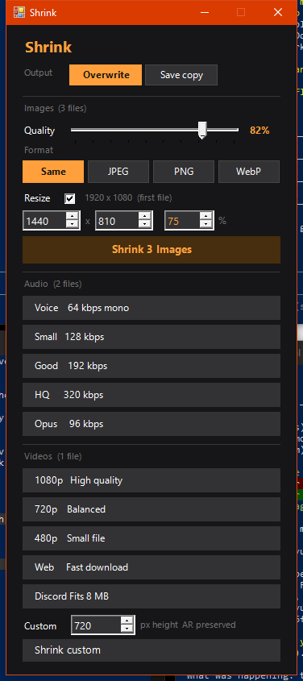
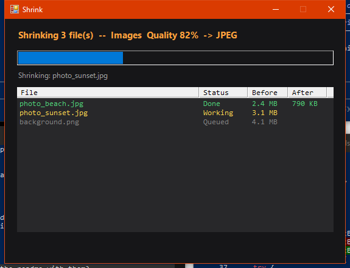
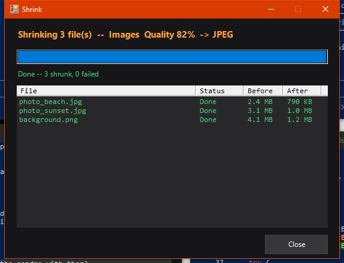

# Shrink Menu

Right-click any image, audio, or video on Windows → **Shrink...** → instant size picker GUI.

## Screenshots

| Picker | In progress | Done |
|--------|-------------|------|
|  |  |  |

## Install

**One click:** Download `ShrinkMenu-Install.exe` from the [latest release](../../releases/latest) and run it.

**Manual:** Clone the repo, right-click `install.ps1` → Run with PowerShell.

## What it does

### Images (requires ImageMagick)
- Quality slider 10–100%
- Format: keep same / JPEG / PNG / WebP
- **Smart resize**: probes actual image dimensions — linked W × H + % fields, change any one and the others update automatically with AR preserved
- Lossless auto-convert: if you pick PNG/BMP/TIFF with "Same" format, prompts to switch to JPEG or WebP for guaranteed compression
- **Overwrite** original or **Save copy** with `_shrunk` suffix
- "No change" status if output is not smaller than input

### Audio (requires ffmpeg)
| Preset | Bitrate | Notes |
|--------|---------|-------|
| Voice | 64 kbps mono MP3 | voice memos, podcasts — tiny |
| Small | 128 kbps MP3 | general use, ~70% smaller than WAV/FLAC |
| Good | 192 kbps MP3 | music quality |
| HQ | 320 kbps MP3 | max MP3, best for lossless source |
| Opus | 96 kbps .opus | modern codec, smallest size |

### Videos (requires ffmpeg)
| Preset | Resolution | Notes |
|--------|-----------|-------|
| 1080p | 1920×? | ~50% smaller, high quality, AR preserved |
| 720p | 1280×? | ~70% smaller, balanced, AR preserved |
| 480p | 854×? | ~85% smaller, small file, AR preserved |
| Web | 1280×? | fast-start, streaming optimized |
| Discord | 854×? | targets Discord 8 MB free upload limit |
| Custom | any height | enter exact px height, width auto-calculated |

Before/after file size shown per file in the progress window.

## Requirements

- ImageMagick 7+ — [imagemagick.org](https://imagemagick.org/script/download.php#windows)
- ffmpeg — [gyan.dev/ffmpeg/builds](https://www.gyan.dev/ffmpeg/builds/)

Both must be on your system PATH. The installer checks and warns if they're missing.

## Integration

The installer registers **Shrink...** on right-click for:

**Images:** jpg jpeg png webp bmp tiff gif heic heif avif
**Audio:** mp3 wav flac aac ogg wma m4a opus aiff ape
**Videos:** mp4 mkv avi mov webm wmv flv ts m4v 3gp

A **Shrink...** button also appears at the bottom of the [FFmpeg Convert](https://github.com/toyuvalo/ffmpeg-context-menu) and [Doc Convert](https://github.com/toyuvalo/doc-convert-menu) pickers.

## Uninstall

Run `uninstall.ps1` with PowerShell.

## Build the exe yourself

```cmd
build.cmd
```

Requires `iexpress.exe` (built into Windows). ImageMagick on PATH regenerates the icon automatically.

## More tools like this

Built by [dvlce.ca](https://dvlce.ca) — see [webdev.dvlce.ca](https://webdev.dvlce.ca) for the full project showcase.

## License

MIT with [Commons Clause](https://commonsclause.com/) — free to use, modify, and share. Commercial resale not permitted.
